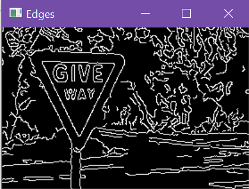

# Traffic Sign Recognition
### 2024, Spring - Szabo Lorand

## Table of Contents:
1. Introduction
2. Theoretical Aspects
3. Methods of Implementation
4. Algorithm
5. Implementation
6. Evaluation & Result
7. Sources

## 1. Introduction
___Traffic Sign Recognition___ (TSR) is a technology developed to recognize traffic signs and displays them on the driver's dashboard. It is part of the _advanced driver-assistance systems_ (ADAS) that uses cameras and sensors to provide for the driver additional information in order to increase road safety and enables various levels of _autonomous driving_. Other technologies part of ADAS are, for instance, adaptive cruise control, lane departure detector, parking sensors and blind spot monitor.

This is a university project that demonstrates some methods to implement a traffic sign recognition system, focusing mostly on classical _image processing_ methods, rather than on _artifficial intelligence_ and _computer vision_.

## 2. Theoretical Aspects

Traffic signs were standardized in 1968 by the _Vienna Convention on Road Signs and Signals_ treaty. This means that this convention enables the consistent use of traffic signs and the implementation of traffic sign recognition.

They are highly visible signs next to or on the roads, typically featuring a border of a specific color (e.g. red with white or yellow background, or blue background and white marking), and an easily interpretable drawing or text in the center of it. The shape of the signs are designed to be easily recognizable (triangle, circle), some important signs having unique shapes, for instance the Give Way or Stop Ahead signs.

Therefore, an ideal approach for traffic sign recognition involves a shape detection algorithm. This can be achieved by modifying the original image into a binary one using the _Canny edge detection_ algorithm (because of the signs' standardized shapes) or using _color based segmentation_ (because of the signs' standardized colors).

## 3. Methods of Implementation

1. Using Convolutional Neural Networks

The most precise and accurate solutions for the traffic sign recognition are implemented using convolutional neural networks (CNNs). These models can classify road signs with over 95% accuracy, being approximately 20% more accurate than classical image processing algorithms.

These methods involve training an AI model using neural networks with convolutional layers. In principle, convolutional layers excel in image recognition and segmentation because the weights of the network depend only on a certain pixel's neighbours. Consequently, it will recognize patterns within a given window's size, resulting in fewer nodes (pixel) at the subsequent layer. Therefore, at the next convolutional layer, it will detect features that are larger in the original image.

2. Using Image Processing algorithms

The following example demonstrates Traffic Sign Segmentation based on _canny edge detection_ and _color based segmentation_.

The steps of the image processing pipeline is the following:

- firstly, the image has to be preprocessed, namely denoised, resized and its contrast is enhanced
- after that, the image is processed using _canny edge detection_ with _shape detection_ and _color based segmentation_ with _shape detection_, separately
- both paths result in outputs that represent the contour of the sign
- the last steps are combining the outputs and computing the bounding box for the merged output

An example for tracing the above steps:

To achieve traffic sign recognition, the detection (segmentation) phase has to be followed by an algorithm that classifies the output of the above implementation.

## 4. Algorithm

This project will implement the second approach from above, namely the traditional image processing algorithm. The idea is recognizing the sign by its form - achieved by the _canny edge detection_ algorithm, respectively by _color based segmentation_, both results applied to a _shape detection_ algorithm. The 2 outputs from the 2 branches are integrated and a bounding box is calculated the contains the traffic sign.

On the other hand, the type of the sign has to be determined by the shape of its border and by the color of it, respectively if this was not enough, its content. For this a _shape classification_ and a _color detection_ algorithm would be ideal.

## 5. Implementation

Details of each step of the pipeline:

1. Image Preprocessing - filters have to be added to enhance some properties of the image and clean it from noise.

    1.1. Noise Filtering
    
    Median Filtering is applied to the original image so that it removes the unexpected and peak pixel values by choosing the median of the pixel's 8-neighbourhood.

    The choice is made by sorting the neighbourhood elements and choosing the value in the middle, illustrated below:

    

    1.2. Contrast Enhancement

    Contrast enhancement algorithms usually stratch the histogram of the image and modify the cumulative distribution function, increasing the spectrum of the colors.

    However, the images have 3 color channels (BGR), therefore, they have to be converted to grayscale images before applying the contrast enhancement algorithm. The grayscale image's histogram will be modified and all 3 color channels will be modified relative to it.

    For the BGR to grayscale conversion the NTSC formula is employed that represent's the people's relative perception of brightness of the 3 color channels: 0.299 * Red + 0.587 * Green + 0.114 * Blue.

    After that, the histogram is stretched to cover the whole spectrum (from 0 to 255) and all the colors are interpolated from the old spectrum to the new one.

    After the application this is how the 3 color's distribution will look like compared to the original:

    

2. Canny Edge Detection

Edge detection is one way of detecting features in an image and it is a quite complex operation. Canny edge detection is an algorithm implemented in the OpenCV library that performs the desired algorithm and results in a similar image:

3. Color Based Segmentation

A different approach of detecting features is by creating 4 different images based on certain colors that are found on the traffic signs, more specifically, red, blue, yellow and black. By applying the correct threshold for the values of the colors, the algorithm will result in an image that displays only the pixels that were in the given range.

For this a high-contrast image is needed and exploits the color property of the traffic signs.

Before color segmentation:

After color segmentation and extraction the red component (image):

4. Shape Detection

To apply shape detection algorithms simpler it is recommended to extract the contours of the color-segmented images. In this case, given as input the output of the color segmentation algorithm, all the white (object) pixels that have a black (background) pixel in their neighbourhood will be contour pixels (white) and all the others black.

The result will look like this:

5. Integrate Outputs

6. Bounding Box Calculation

## 6. Evaluation & Result

## 7. Sources
[1] Algorithm using Convolution Neural Nets: https://www.analyticsvidhya.com/blog/2021/12/traffic-signs-recognition-using-cnn-and-keras-in-python/

[2] Comparison of ML solutions: https://www.ncbi.nlm.nih.gov/pmc/articles/PMC10223536/#:~:text=Traffic%20sign%20recognition%20can%20be%20divided%20into%20machine%20learning%20and,NN)%2C%20and%20decision%20trees.

[3] Traditional Traffic Sign Segmentation pipeline: https://jq0112358.medium.com/traffic-sign-segmentation-with-classical-image-processing-methods-canny-edge-detection-color-8ff1096535db

[4] Canny edge detection: https://docs.opencv.org/4.x/da/d22/tutorial_py_canny.html

[5]